# EventVault — Event & Media Management Platform

A full-stack, production-ready platform for clubs and societies to upload, organize, and interact with event media — with AI tagging, facial recognition, role-based access, and dynamic watermarking.

---

## Tech Stack

| Layer     | Technology                              |
|-----------|-----------------------------------------|
| Backend   | Python 3.11 · FastAPI · SQLAlchemy · SQLite |
| Frontend  | React 18 · Vite · Tailwind CSS          |
| AI/ML     | Pillow-based smart tagging · histogram face-match |
| Storage   | Local filesystem (drop-in AWS S3 ready) |
| Auth      | JWT · bcrypt · role-based guards        |

---

## Quick Start

### 1 — Backend

```bash
cd backend
python -m venv venv
source venv/bin/activate        # Windows: venv\Scripts\activate
pip install -r requirements.txt
pip install pydantic-settings   # if not already installed
python seed.py                  # populate demo data
uvicorn app.main:app --reload --port 8000
```

API docs: http://localhost:8000/api/docs

### 2 — Frontend

```bash
cd frontend
npm install
npm run dev
```

App: http://localhost:5173

---

## Demo Credentials (all passwords: `demo1234`)

| Role         | Email               |
|--------------|---------------------|
| Admin        | admin@demo.com      |
| Photographer | photo@demo.com      |
| Club Member  | member@demo.com     |
| Viewer       | viewer@demo.com     |

---

## Features

### Core
- **Event Management** — Create, filter, search events by name/category/date
- **Bulk Media Upload** — Drag-and-drop, multi-file, preview before upload
- **Role-Based Access** — Admin / Photographer / Club Member / Viewer
- **Social Features** — Like, comment, download, real-time notification bell
- **AI Smart Tagging** — Auto-generates contextual tags (nature, crowd, sports…) on every upload
- **Facial Recognition** — Upload selfie → find yourself across all event photos
- **Dynamic Watermarking** — Club name + event name + role stamped on every download
- **Advanced Search** — Filter by tag, event name, uploader username
- **Infinite Scroll Gallery** — Load-more pagination on EventDetail

### Access Control Matrix

| Action              | Admin | Photographer | Club Member | Viewer |
|---------------------|-------|--------------|-------------|--------|
| Create events       | ✅    | ✅           | ❌          | ❌     |
| Upload media        | ✅    | ✅           | ❌          | ❌     |
| View private events | ✅    | ✅           | ✅          | ❌     |
| Like / comment      | ✅    | ✅           | ✅          | ✅     |
| Download (watermark)| ✅    | ✅           | ✅          | ✅     |

---

## Screenshots

### 🔐 Authentication
**Login Page**
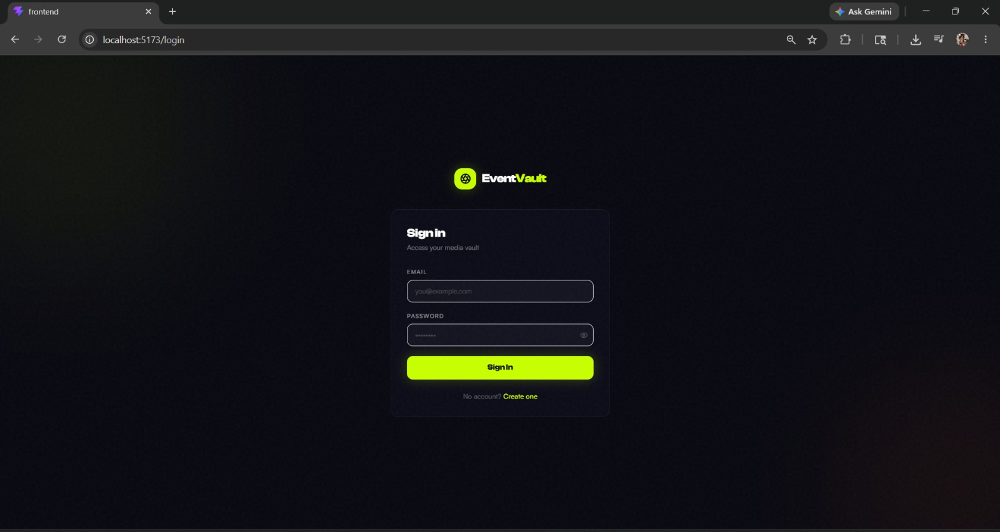

**Register Page — Role Selection**
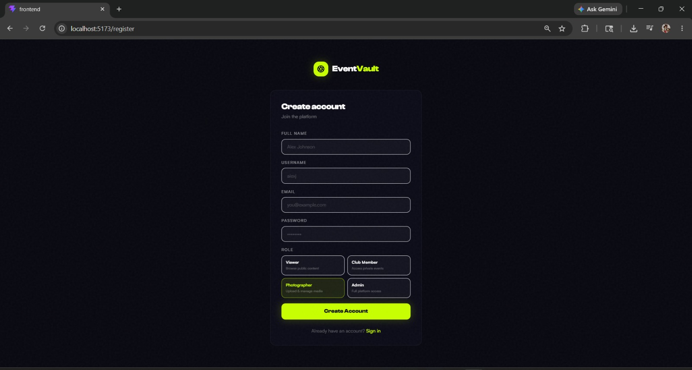

---

### 📊 Dashboard
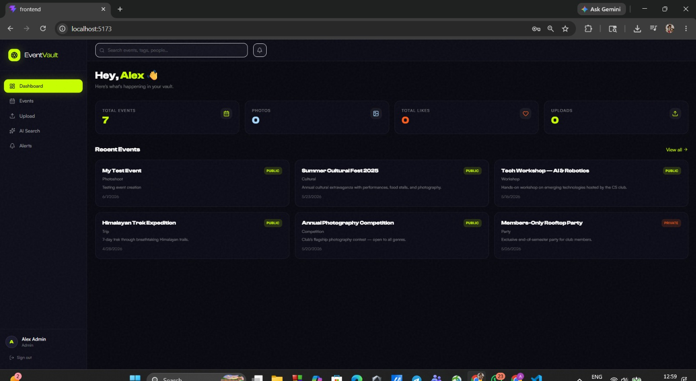

---

### 📅 Event Management
**Events List with Category Filter**
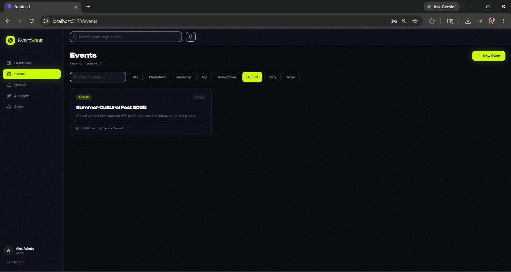

---

### 🖼️ Event Detail & Tag Filter
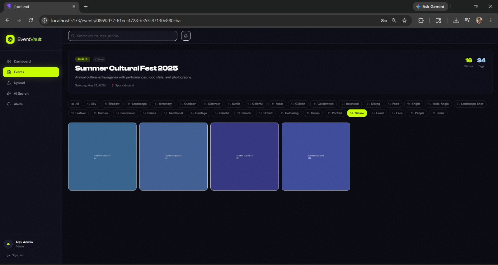

---

### 💬 Photo Lightbox with Comments
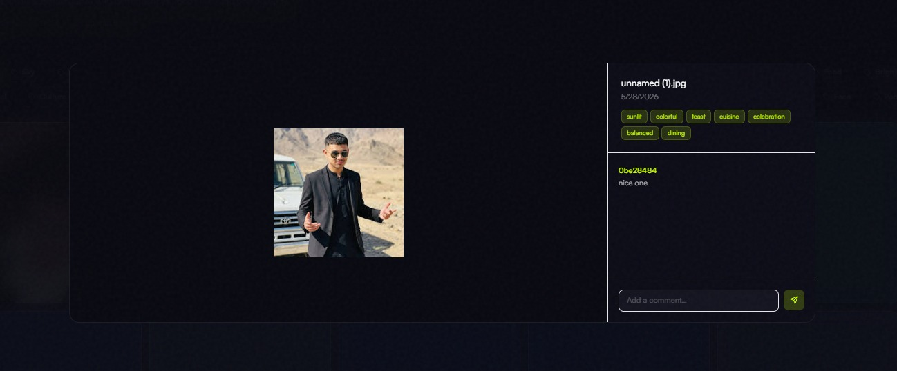

---

### 📤 Media Upload System
**Files Queued for Upload**
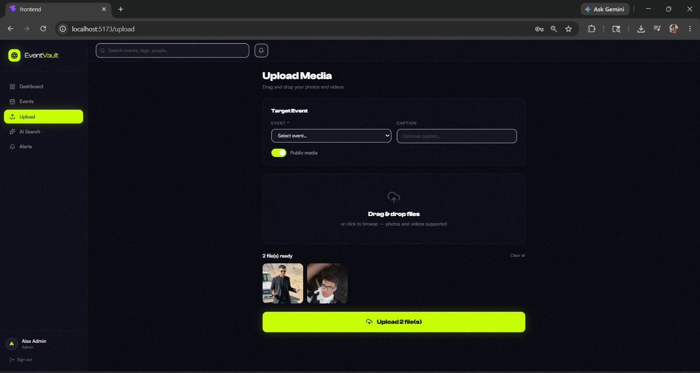

**AI Tags Generated After Upload**


---

### 💧 Dynamic Watermark on Download
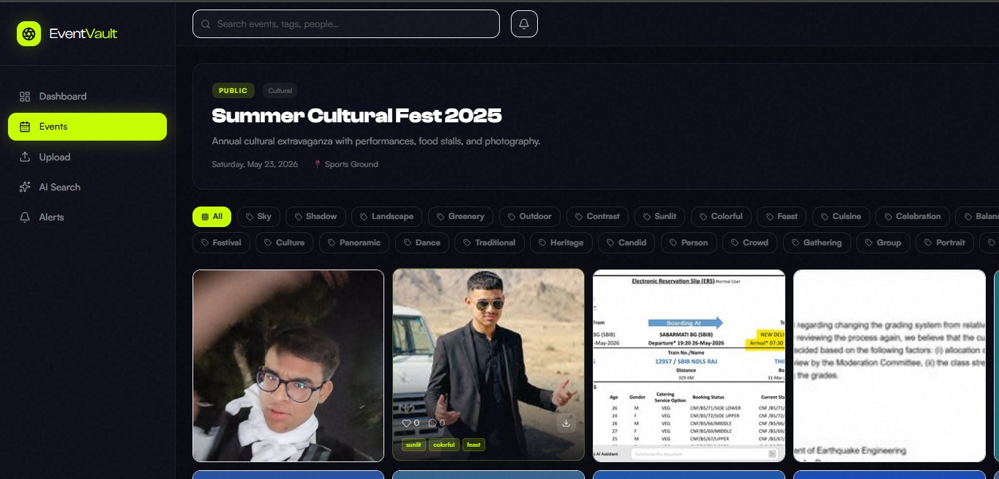

---

### 🤖 AI Smart Tag Search
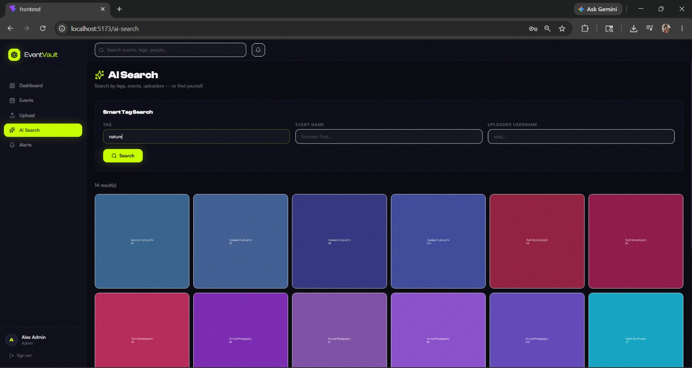

---

### 🤖 Facial Recognition — Find Me in Photos
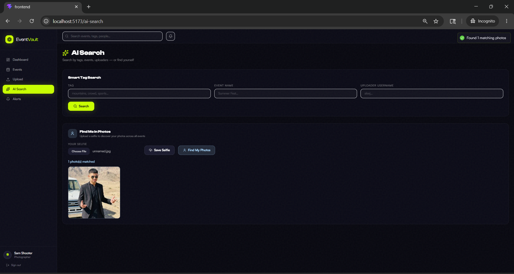

---

### ❤️ Social Features — Likes & Comments


---

### 🔔 Notifications
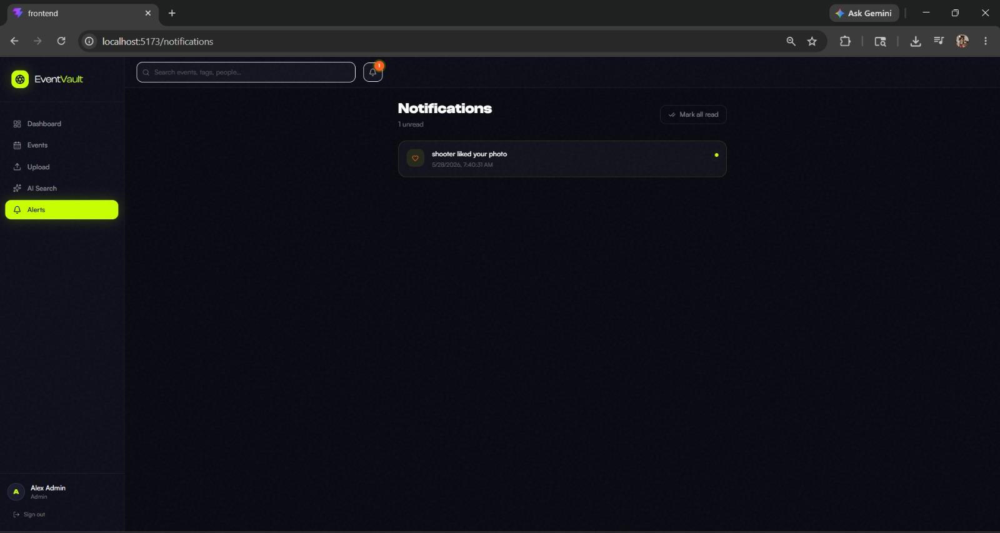

---

### 🔒 Role Based Access Control
**Viewer Blocked — 403 Forbidden**
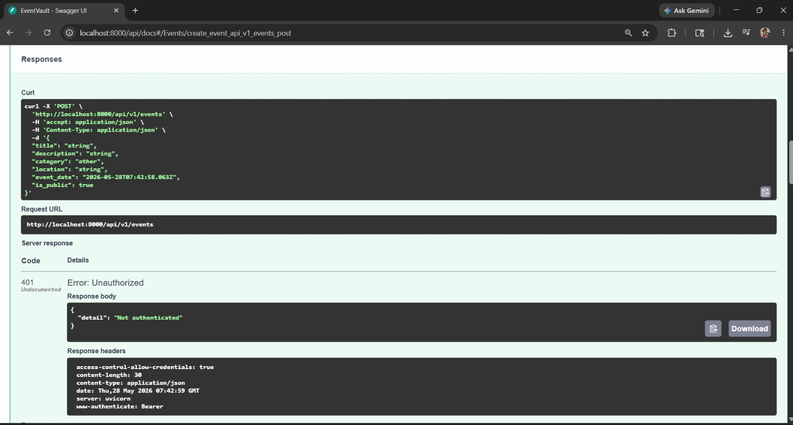

**Admin Success — 201 Created**
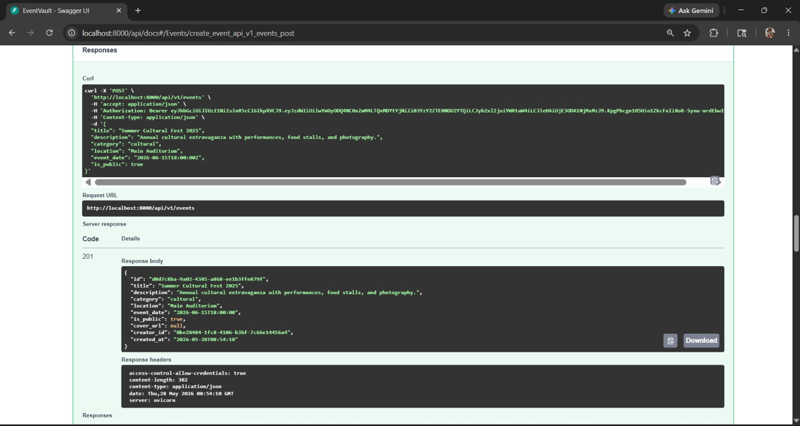

---

### 📋 Swagger API Documentation
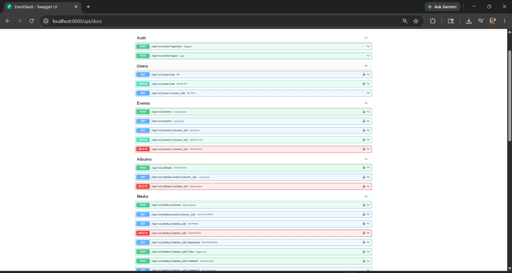


---

## Architecture

```text
┌─────────────────────────────────────────────────────────┐
│                     FRONTEND (React)                     │
│  Login/Register → AppShell (Sidebar + Topbar)           │
│  Dashboard · Events · EventDetail · Upload               │
│  AISearch · Notifications                                │
│  Components: MediaCard · MediaLightbox · Modal           │
└────────────────────┬────────────────────────────────────┘
│ HTTP/REST (Vite proxy → :8000)
┌────────────────────▼────────────────────────────────────┐
│                   BACKEND (FastAPI)                      │
│                                                          │
│  /api/v1/auth          JWT register · login             │
│  /api/v1/users         profile · update                 │
│  /api/v1/events        CRUD · filter · search           │
│  /api/v1/albums        CRUD per event                   │
│  /api/v1/media         upload · download · like ·       │
│                        comment · watermark               │
│  /api/v1/ai            tag search · selfie · my-photos  │
│  /api/v1/notifications list · mark-read                 │
│                                                          │
│  Services: watermark.py · ai_tagging.py                 │
│            thumbnail.py · face_match.py                 │
└────────────────────┬────────────────────────────────────┘
│
┌────────────▼────────────┐
│   SQLite (eventvault.db) │
│   + Local uploads/       │
└─────────────────────────┘
```

---

## Project Structure

```text
/
├── backend/
│   ├── app/
│   │   ├── api/v1/endpoints/   auth · users · events · albums
│   │   │                       media · ai · notifications
│   │   ├── core/               config · security
│   │   ├── db/                 database · init_db
│   │   ├── models/             user · event · album · media · social
│   │   ├── schemas/            user · event · media
│   │   ├── services/           watermark · ai_tagging · thumbnail · face_match
│   │   └── main.py
│   ├── uploads/                photos · thumbnails · watermarked · avatars
│   ├── seed.py
│   └── requirements.txt
│
└── frontend/
└── src/
├── components/
│   ├── layout/         AppShell · Sidebar · Topbar
│   └── ui/             MediaCard · MediaLightbox · Modal · Badge · Spinner
├── context/            AuthContext
├── lib/                api.js
└── pages/              Dashboard · Events · EventDetail
Upload · AISearch · Notifications
```

---

## Evaluation Coverage

| Criterion                   | Weight | Implementation                              |
|-----------------------------|--------|---------------------------------------------|
| UI/UX and Design            | 15%    | Volt/obsidian design system, Clash Display  |
| Backend Architecture & APIs | 15%    | FastAPI, SQLAlchemy, 7 routers, clean DI    |
| Authentication & Access     | 10%    | JWT, bcrypt, 4-role RBAC guards             |
| Cloud Integration           | 15%    | Local FS (S3-ready UPLOAD_DIR config)       |
| Media Management            | 15%    | Bulk upload, thumbnails, albums, download   |
| AI/ML Features              | 15%    | Auto-tagging, histogram face-match, search  |
| Real-time Notifications     | 5%     | DB-backed notifs, unread badge, bell        |
| Code Quality & Scalability  | 5%     | Typed schemas, service layer, env config    |
| Innovation & Bonus          | 5%     | Watermark, lightbox, infinite scroll, grain |